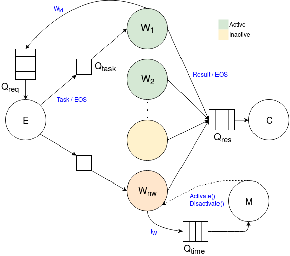

# Parallel-and-Distributed-Systems

Implementation and validation of the Farm stream parallel pattern with concurrency throttling mechanism.
     

Autonomic farm design. Each node in the graph corresponds to a single thread of execution. The archs connecting the nodes define the interaction between modules. Continues arrows implicitly indicate send() and receive() operations via channels, and the archs are labeled with the data transferred. Discontinues arrows are labeled with functions that access the state of another module. Active and inactive workers are shown.
